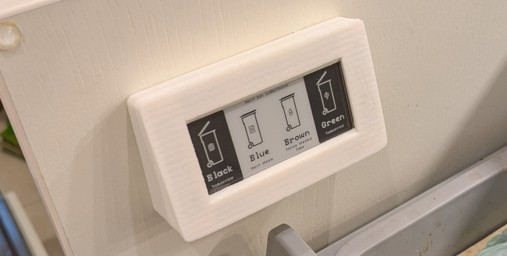

Bin Computer: A computer for your bins!
=======================================

**A battery-powered E-Ink gadget which tells you when the bins need to go
out.**

A quick-and-dirty project built on the [Pimoroni Badger 2040
W](https://shop.pimoroni.com/products/badger-2040-w?variant=40514062188627)
paltform and crudely scraping the [Stockport bin collection
website](https://www.stockport.gov.uk/find-your-collection-day) (alas, no API
is available).

> [!IMPORTANT]
> 
> Unless you happen to live in Stockport, this project is not much use to you!
> In fact, I deliberately haven't specified a license for this project, so
> confident am I that nobody will ever care!

Implementation notes
--------------------

To reduce the need to dismantle and reflash the gadget in the event of API
changes, a server sits between the gadget and the Stockport bin collections
website.

The server exposes a very simple API: hit `/` and you get a 196x128 pixel 1-bit
PNG showing the next bin collections ready to show on the E-Ink display. It
also sets the `X-Next-Update` header to the number of seconds until the graphic
needs to be updated.

Because I love Inkscape, *obviously* the server uses Inkscape to generate the
display graphics. Did you know Inkscape has a fairly powerful command language
which can do things such as using CSS selectors to selectively show/hide/modify
elements before rendering an SVG? (See `inkscape --action-list`).

> [!NOTE]
> Inkscape (and SVG in general) is not at all great for doing pixel-perfect
> 1-bit graphics. And yet I used it anyway. What are you going to do about it?
